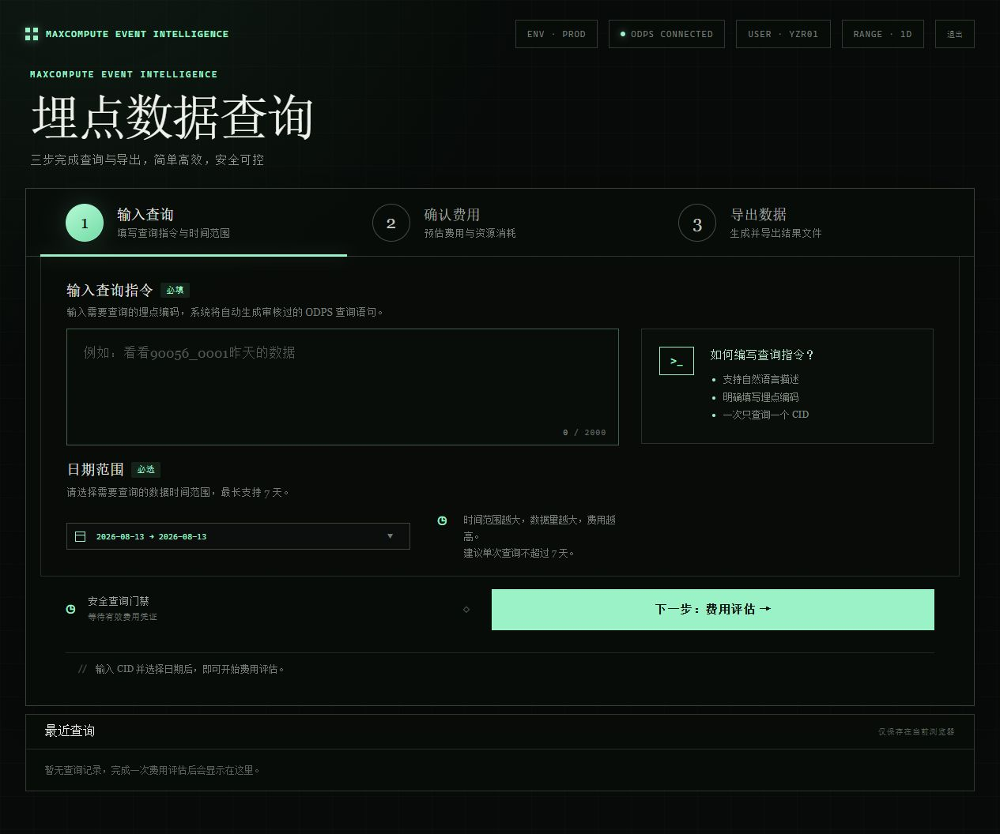

# 埋点数据自助拉取工具

这是一个面向数据分析、产品和运营同事的内部工具骨架：用户从企业微信或网页提交自然语言问题，服务提取事件编码，查询 MaxCompute/ODPS 最近 7 个自然日的数据，生成包含原始明细和 `聚合统计` Sheet 的 Excel 文件，并记录请求与下载审计。



当前发布版本：`v0.0.3`

## 当前状态

已提供可配置的 V1 服务结构、事件编码解析、SQL 安全渲染、后台任务接口、审计模型、ODPS 网关、XlsxWriter 流式导出、Docker 部署文件和单元测试。XLSX 构建为纯 Python 实现，不依赖 Node.js、Codex 或私有 npm 包。它**不会**在没有账号、表名、字段和企业微信应用配置时访问任何生产数据。

在接入前，请先确认企业微信入口：普通“群机器人 Webhook”适合向群里发送消息，不能作为用户输入后由服务接收并处理的入口。此需求应使用企业微信的“智能机器人 API 模式”或自建应用的消息回调；详见 [docs/architecture/v1-design.md](docs/architecture/v1-design.md)。

## 本地启动

1. 复制 `.env.example` 为 `.env`，填写 **测试环境** 的 ODPS 参数和管理员令牌；生产环境请改用 RAM 最小权限凭证或临时 STS 凭证。
2. 将实际、已审核的查询 SQL 改写到 `sql/event_detail.sql`。该 SQL 必须返回 `event_date` 和 `user_id` 两个别名列。
3. 使用 Docker Compose 启动 API、Worker、PostgreSQL 和 Redis：

   ```bash
   docker compose up --build
   ```

4. 打开 `http://localhost:8000/` 提交问题。开发环境 API 文档在 `http://localhost:8000/docs`。

## 登录、查询窗口与统计

- 网页必须先登录；会话保存在签名的 HttpOnly Cookie 中，密码只保存 scrypt 哈希。
- 默认查询昨天，用户可以选择最长 7 天的完整日期区间；今天及未来日期不可查询。费用凭证会绑定账号、CID 和分区，修改日期后必须重新评估。
- 超级管理员统计页地址为 `/admin/usage`，普通成员即使知道地址也会被服务端拒绝。统计项包括账号访问次数、停留时间、费用评估次数、导出次数、估算消耗金额、IP 和访问时间戳。
- 超级管理员可以设置全局单用户每日查询金额上限（0 表示不限制）；成员和超级管理员均在导出前由服务端校验当日余额。
- 查询成功后页面显示按 `dt` 聚合的 PV/UV 图表，并提供包含“原始数据”和“聚合统计”两个工作表的 XLSX 下载。

本地新增或重置普通成员账号：

```powershell
.\.venv\Scripts\python.exe .\scripts\manage_users.py upsert member01 --display-name "成员一"
```

命令会在终端中安全提示输入密码，不会把密码写入命令历史。查看或停用账号：

```powershell
.\.venv\Scripts\python.exe .\scripts\manage_users.py list
.\.venv\Scripts\python.exe .\scripts\manage_users.py deactivate member01
```

## V1 接口

- `POST /api/v1/query-requests`：接收网页或标准化企业微信入口转发的 `{ "question": "查询 10001_0001" }`。
- `GET /api/v1/jobs/{job_id}`：查看异步任务状态。
- `GET /api/v1/jobs/{job_id}/download`：下载结果并写入下载审计。
- `GET /api/v1/admin/stats`：管理员统计接口，需要 `X-Admin-Token`。

## 接入时需要提供的最小信息

不要把 AccessKey 贴到代码库或聊天记录。请通过受控密钥渠道配置：

1. ODPS Project、Endpoint、Tunnel Endpoint 和只读 RAM/STS 授权方式；
2. 固定数据表名、分区字段及格式、CID 字段、UV 去重字段；
3. 现有的、可运行的明细 SQL（需声明哪些字段可导出）；
4. 企业微信选择的接入模式以及测试应用的回调参数；
5. 最大允许导出行数、数据保留时长和有权限使用该工具的部门/人员范围。

## 验证

核心单元测试不需要 ODPS 或企业微信凭证：

```bash
pytest -q
```

关于 xlsx 的实际构建与视觉验证，见 [docs/runbook/development-and-deployment.md](docs/runbook/development-and-deployment.md)。
