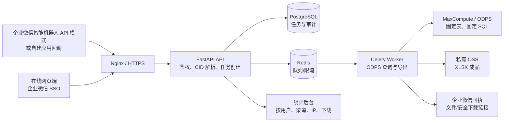

# 埋点数据自助拉取工具 V1 技术方案

## 1. 需求边界与成功标准

**V1 功能**：内部用户在企业微信或网页输入一句话；系统从中唯一识别 CID（例如 `10001_0001`），按固定 SQL 查询固定 ODPS 表最近 7 个自然日（默认含今天）的明细；在 ODPS 内按日期计算 PV、UV；生成一个包含 `原始数据` 与 `聚合统计` 的 `.xlsx`；通知用户并记录请求、下载和失败原因。

**不在 V1 做**：任意 SQL、任意日期范围、自动理解中文埋点名、截图 OCR/视觉识别、向未授权用户开放数据、实时流式问答。这样可以先把权限、成本和数据口径控制住。

### 非功能需求（待业务确认的建议值）

| 项目 | V1 建议 |
| --- | --- |
| 可用性 | 内部工具 99.5%，工作日支持 |
| 并发 | 20 个排队任务、每用户同一时刻 1 个任务 |
| 完成时间 | 95% 在 10 分钟内完成；超过 15 分钟超时告警 |
| 数据安全 | TLS、ODPS 只读最小权限、私有文件、审计留存 180 天 |
| 导出保护 | 默认最多 200,000 行；不静默截断，超限提示缩小范围/走离线流程 |
| 文件保留 | 默认 7 天，定时删除；数据库仅保留文件元数据 |

Excel 单 Sheet 上限为 1,048,576 行；因此上线前需根据真实数据量决定默认行数上限。PV/UV 统计不会受明细导出上限影响，因为它在 ODPS 内单独聚合。

## 2. 高层架构

采用**模块化单体**而不是微服务：V1 只有一个明确业务域、团队和访问量都未知，拆成多个服务只会增加部署与排障成本。API 与 Worker 是同一代码仓库中的两个进程；当查询量增长时可独立扩容 Worker。

## 3. 企业微信接入选择（关键前置决策）

普通“企业微信群机器人 Webhook”用于服务端向群中发送消息，不能把群成员输入的消息主动推给你的服务。因此它不能单独实现“用户问机器人、机器人查询并返回文件”。建议二选一：

| 选择 | 适用情况 | V1 推荐度 |
| --- | --- | --- |
| 企业微信智能机器人 API 模式 | 要实现群内/单聊式机器人问答；平台把用户消息回调给服务 | 推荐 |
| 企业微信自建应用 + 接收消息回调 | 企业已有应用、SSO 和权限体系；需要工作台网页端 | 推荐 |
| 仅群机器人 Webhook | 仅需要群播报，不能接收问题 | 不适用作输入入口 |

回调 URL 必须为公网可访问的 HTTPS 地址，并在入口处完成企业微信签名校验与消息解密。Worker 完成后经官方“上传临时素材/发送应用消息或智能机器人回复”接口返回文件；若文件大小、会话或接口限制不满足，则发送**一次性、短有效期的私有下载链接**。线上页面以企业微信 OAuth/SSO 获取账号；不允许从客户端 Body 直接相信“账号”字段。

## 4. 查询与文件流

1. 入口记录原始问题、渠道、企业微信 `user_id`/网页登录账号、接收时间与可信源 IP，创建 `queued` 任务。
2. CID 解析器从问题中抽取并去重。没有 CID 或出现多个不同 CID 时不提交查询，直接提示用户补充一个准确编码。
3. Worker 根据上海时区计算 `[今天-6 天, 今天]` 分区边界，使用管理员维护的 SQL 模板渲染查询。CID 只作为绑定参数值；表名、字段、模板都不接受用户输入。
4. Worker 先提交 `GROUP BY event_date` 的聚合 SQL，再提交明细 SQL。PyODPS 通过 InstanceTunnel 读结果，流式写入临时 CSV，并对行数/超时/文件大小进行保护。
5. xlsx 构建器产出 `原始数据` 和 `聚合统计`；后者包含日期、PV、UV 及总计。成品上传私有 OSS，任务变为 `succeeded`。
6. 渠道适配器向企业微信回复文件或安全链接；网页端轮询任务状态并下载。每一次下载写入单独的 `download_logs` 记录。

> 注意：企业微信回调能提供企业用户标识，但通常无法提供用户设备的公网 IP；“IP”应以网页/API 实际请求的可信反向代理地址记录。机器人入口可审计账号、会话、消息 ID、时间与来源类型，不能把机器人服务器 IP 误当成人员 IP。

## 5. CID 抽取方案评估

V1 推荐正则：`(?<![A-Za-z0-9_])\d{5}_\d{4}(?![A-Za-z0-9_])`，并在服务端强制“恰好一个唯一编码”。它可以覆盖“我需要查询10001_0001埋点”“10003_0002帮我看一下”等自然问法。

| 方案 | 准确性/成本 | 风险 | 结论 |
| --- | --- | --- | --- |
| 正则 + 单编码校验 | 对固定编码格式可确定、零模型成本、低延迟 | 格式变更时要更新规则 | V1 使用 |
| 正则候选 + 大模型复核 | 能理解绕写 | 模型误判、外发问题文本、成本与延迟 | 仅作为可观测的备用 |
| LLM/RAG 直接抽取 | 适合“中文埋点名” | 需维护文档索引和置信度，不能直接执行 | V2 使用 |

无论使用哪种模型，最终 CID 都必须匹配白名单格式、与埋点文档的版本化映射一致，并在多候选/低置信度时询问用户，绝不猜测后执行。

## 6. 权限、审计与运维

- ODPS：使用仅能读取固定 Project/表的 RAM 角色或短期 STS，不使用主账号 AccessKey；开启来源 IP 白名单（如公司网络要求）。
- 服务：Nginx TLS、企业微信回调验签、管理员后台 RBAC、Redis 任务限流、按账号限并发。
- 文件：私有 OSS bucket、随机对象键、7 天过期、下载 URL 短时有效，避免公开桶或永久地址。
- 审计：`query_jobs` 保存问题、CID、提交/完成时间、状态、ODPS 实例 ID、行数、错误码；`download_logs` 保存任务、账号、IP、User-Agent、时间。错误日志不得记录 AccessKey、SQL 中可能含有的个人数据或完整明细。
- 可观测性：结构化日志、任务耗时/失败率/队列深度/ODPS 扫描量指标，失败和导出超限告警。

## 7. V2 演进

1. 接入版本化埋点文档（CID、中文名、端、页面、参数、负责人），采用关键词检索 + 规则重排 + LLM 受控抽取；回复候选让用户确认。
2. 截图先经 OCR 抽取 CID，再走同一正则、白名单和确认链路；OCR 失败/多候选不自动提交。
3. 支持受权限控制的日期范围、字段选择和异步大导出（CSV/OSS），但禁止自由 SQL。

